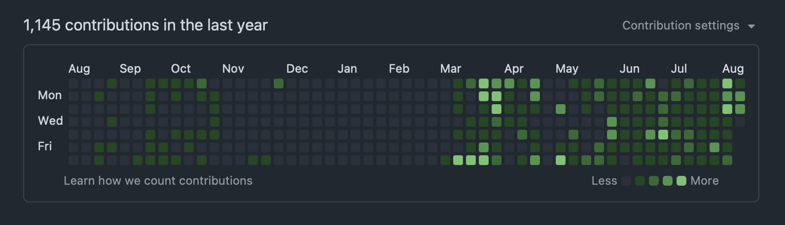

# hello world

This project started quite a while ago (it's been 3 months already!), and at the time of writing there still isn't much in the way of a landing page, README, or really even that much of a working prototype. It's kind of funny because while there's been steady progress on uix since its inception earlier in March, to some degree there's not much to show for it yet.

We have interactions for chatting pretty well supported with custom rendering for user-provided tool calls. We have auth flows working for all of the major providers with both OAuth and API. We have state tracking available so your agents can stay on top of your interactions without you having to tell it explicitly. Model selection with favorites up top, session switching with custom titles, admittedly the bare minimum to work with an agent on anything.

The repo currently ships with some features that allow for an out of the box experience that allows for uix based apps to be build without using an external agent. The canvas feature we ship provides the user and their agent with a html/js/css based scratch pad that they can use to interactively communicate with visual elements. Under the hood it uses token-based line anchor ranges to handle edits instead of line numbers or find and replace, one of the many great ideas proposed by [dirac](https://github.com/dirac-run/dirac) (an agent focused on token efficiency and latency optimizations).

For three months of activity it may not seem like a lot of functionality -- and thats true -- but things take time and care when every facet of the uix runtime is built to be extensible. uix is designed to allow you to move fast when building agentic tools, but in order for that to happen I have to provide a consistent and reliable base experience.

The meta right now is to use LLMs to move at breakneck speeds, but I don't really see that lasting forever. Certainly the amount of code being created for this project is more than the pace I could sustain by hand, but I've never once tried to optimize for that in the core runtime (the features allow for some affordance there since they are just examples). To the degree that you can still consider agent-driven development a craft, this project is meant to be a place to explore whats now possible thanks to LLMs. My aim is for this project to be something worth using, worth maintaining, and worth cherishing.

> In truth, whatever is worth doing at all, is worth doing well; and nothing can be done well without attention...

- [Philip Dormer Stanhope](https://www.gutenberg.org/files/3361/3361-h/3361-h.htm), _4th Earl of Chesterfield._
